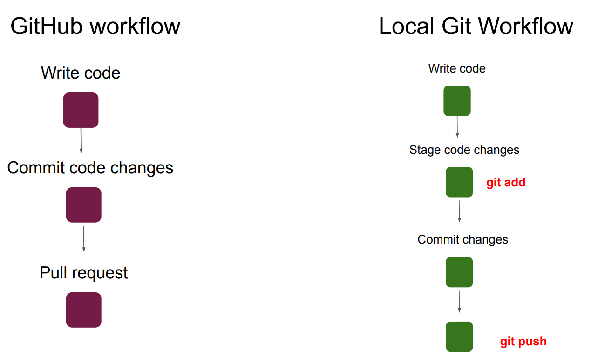
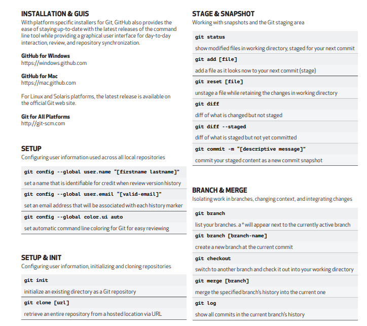

# Git and GitHub 
## what is Git?
   - Git is a free and open-source version control system. It tracks changes made to a file.

## what is VCS?
   - A system that keeps track of our files or projects.
   - It allows you to revert selected files to a previous state.
    revert the entire projects to the previous state, compare changes over time, see who last modified something so that we can know what might be causing a problem, or what is the issues, who made it and when with the details.
   - There are two types of VCS:  1.Centralized  2.Distributed 

## why Git? 
- Free & Open Source, Scalable, Super Fast, Cheap branching and merging 

## GitHub 
- Github is a web based hoisting service for git repositories, you can use git without github, but you can't use github without Git.

## Local Repositories
- Every VCS tools provides a private workplace as a working copy. Developers make changes in their private workplace and after commit. these changes become a part of the repository. Users can perform many operations with this repository such as add files, remove file, rename file, move file, commit changes and many more.

## Working Directories and Staging area of Index
- An intermediate area where commits can be formatted and reviewed before completing the commit.

## push & pull
- Push: Send a Change to another repository (may requyire permissions)
- Pull: Grab a change from the repository

## Basic workflow of Git
   

  

## Blobs 
- Blob stand for Binary large object. Each versions of file is represented by blob. A blob holds the named as SHAT hash of that file. in Git, files are not addressed by names. Everything is content-addressed.

## Trees 
- Tree is an object, which represents a directory. it holds blobs as well as other sub-directories. A tree is a binary file that stores references to blob and trees which are also named as SHA1 hash of the tree object.

## Commits
- Commit holds the current states of the repository. A Commit is also named by SHA1 hash.
- Commit object = A node of the linked list 
- Every commit object has a pointer to the parent commit object
- From a given commit, you can traverse back by looking at the pointer to view the history of the commit
- if a commit has multiple parent commits, the that particular commit has been created by merging two branches.

## Git Commands 

## Merge Conflicts
- If you changed the same part of the same file differently in the two branches you’re merging, Git won’t be able to merge them cleanly. If your fix for feature branch modified the same part of a file as the hotfix branch, you’ll get a merge conflict.

## Git commands to resolve conflicts
- `git log --merge`: produce the list of commits that are causing the conflict.
- `git diff`: Identify the differences between the states repositories or files.
- `git checkout`: Used to undo the changes made to the file, or for
changing branches.
- `git reset --mixed`: Used to undo changes to the working directory and staging area.
- `git merge --abort`: Helps in exiting the merge process and returning back to the state before the merging began.
- `git reset`: Used at the time of merge conflict to reset the conflicted files to their original state.

